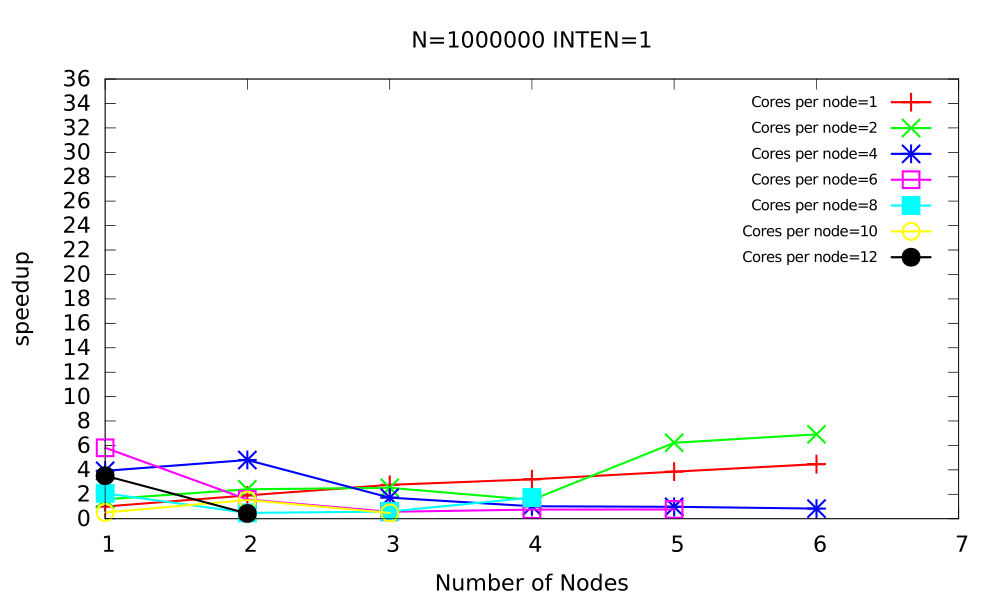
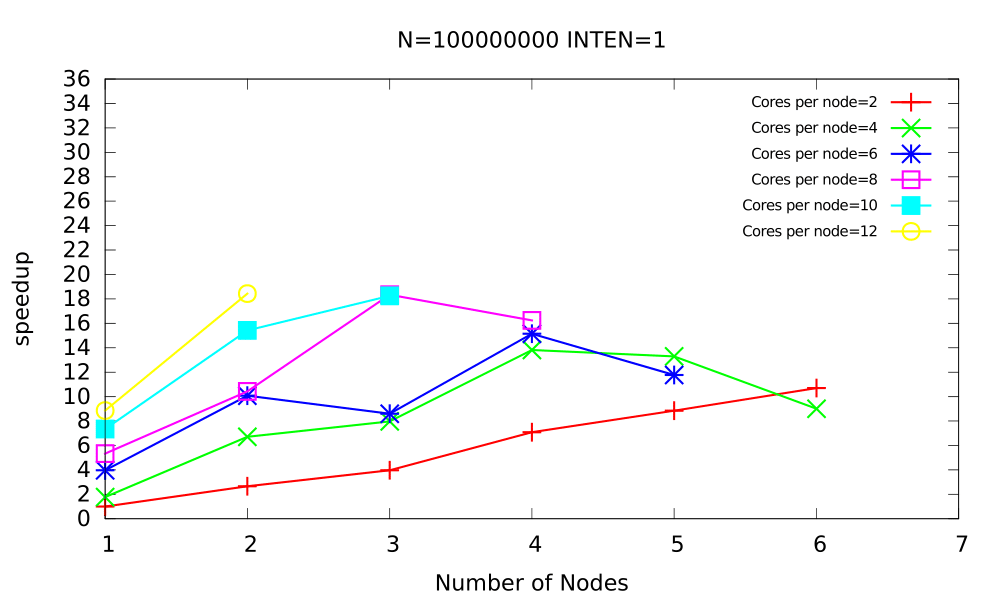

# Computing numerical integrations on multiple machines with MPI

- [Computing numerical integrations on multiple machines with MPI](#computing-numerical-integrations-on-multiple-machines-with-mpi)
  - [Overview](#overview)
  - [Results](#results)
    - [Numerical Integration](#numerical-integration)
    - [Numerical Integration (Master Worker v1)](#numerical-integration-master-worker-v1)
    - [Numerical Integration (Master Worker v2)](#numerical-integration-master-worker-v2)
    - [2D Heat Equation](#2d-heat-equation)
      - [With weak scaling](#with-weak-scaling)
      - [With strong scaling](#with-strong-scaling)

The following repository houses the source for multiple experiments that perform various computations on multiple machines communication with Open-MPI.

## Overview

The primary purpose here was to observe the magnitude of speedups as additional processes and nodes are added into the mix.

- `hello_world` - printing hello world from multiple process on multiple machines.

- `num_int` - application that performs the computation and scripts for plotting.

- `master_worker/v1` - the same computation for numerical integration performed via the master-worker dynamic workload partitioning scheme.

- `master_worker` - the same computation for numerical integration performed via the master-worker dynamic workload partitioning scheme, with the master providing multiple chunks of work to each worker.

- `heat` - computes the `kth` iteration of the heat equation in 2d discrete space, as given by the following equation -

  

## Results

- The `x-axis` indicates the numbers of nodes. Each node houses a dual Intel Xeon E5-2667 v3.
- The `y-axis` indicates the speedup factor.
- There is a line each for the number of cores utilized per core, from `1` to `12`.

### Numerical Integration

### Numerical Integration (Master Worker v1)

### Numerical Integration (Master Worker v2)

### 2D Heat Equation

#### With weak scaling

#### With strong scaling

